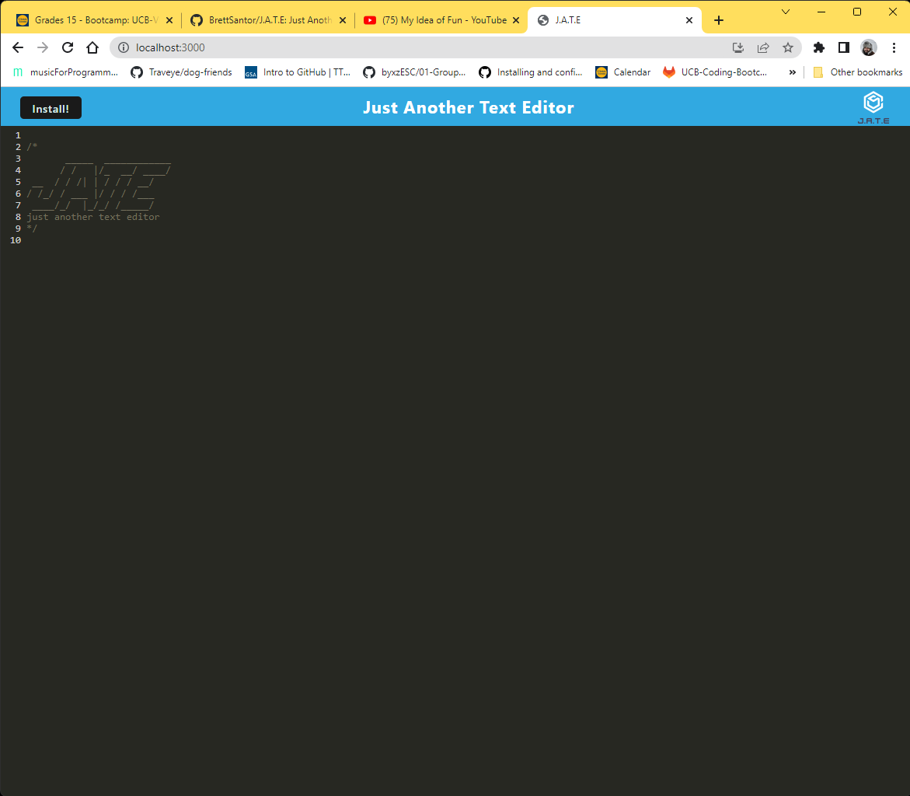

# J.A.T.E

## description
[Deployed Link](https://young-lowlands-73976.herokuapp.com/)
Just Another Text Editor, or J.A.T.E, is a text editor in the style of JavaScript and uses IndexDB to save text to the client side database and local storage. This allows you to still access your data when you install this PWA.

 
## Table of Contents 
 * [Installation](#installation)
* [Usage](#usage)
* [Credits](#credits)
* [Contributions](#contribution)
* [License](#license)
* [Testing](#Testing)
* [Questions](#questions)

## Installation 
 n/a
## Usage 
Click on the link above to open the site and the header should appear. 
Then you can clear the header and start typing away. When the text editor becomes out of focus it saves the text to the client side database. 
## Credits 
 All this coding made possible by [Jerome Chenette](https://github.com/jeromechenette) and my fellow students who help each other along the way
## Contributions 
 n/a
## License 
 MIT
## Testing 
n/a
## Questions 
 If you have any questions you can refer to my github at this link or email me! 
 * [Github](github.com/BrettSantor) 
* b.santor27@gmail.com